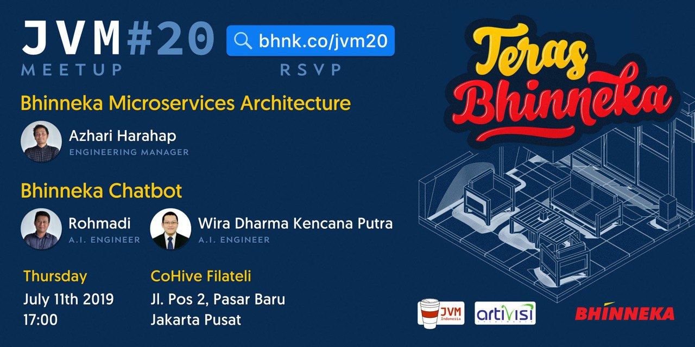

# JVM-Meetup-20
Summarize from JVM Meetup #20 "Teras Bhinneka" @ BHINNEKA

Hari & Tanggal : Kamis, 11 Juli 2019

Lokasi : Bhinneka Office - COHive Filateli

Jl. Pos Pasar Baru 2 Jakarta Pusat

Speaker : 

1. Azhari Harahap (Engineering Manager) : "Bhinneka Microservice Architecture" 
2. Rohmadi & Wira Dharma Kencana Putra (AI Engineer) : "Bhinneka Chatbot"
 

## JVM MEETUP 20 PHOTO SESSION

Ayo join JVM User Group di telegram untuk diskusi lebih lanjut.

Join Us : [@JVMUserGroup](https://t.me/JVMUserGroup)

Like & Follow Instagram : [JVM Indonesia](https://www.instagram.com/jvmindonesia/)

Like & Follow : [JVM Developer ID](https://www.facebook.com/JVMDeveloperID/)

Subscribe : [JVM Indonesia](https://www.youtube.com/channel/UCXwXmQEQySqhqAMmys4N56w)